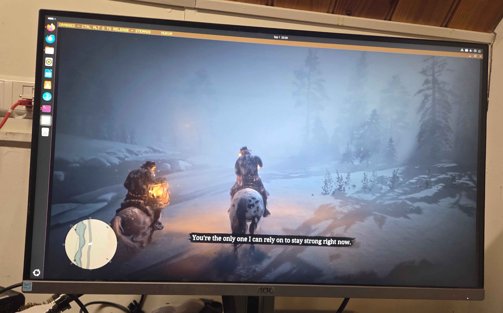
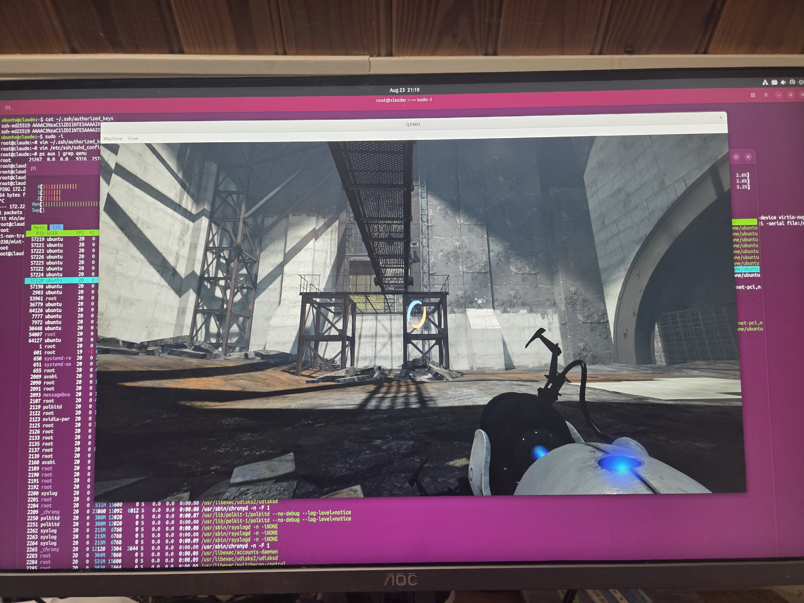
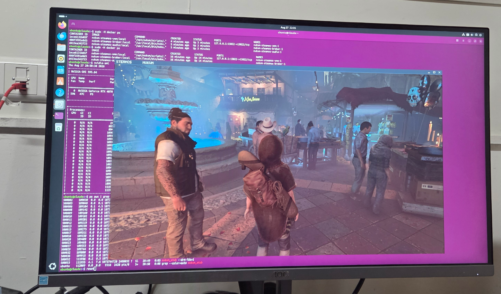

# nvkvm-pv on SteamOS

**Run SteamOS in a VM, play Steam games on your NVIDIA GPU — while the host keeps
using the same GPU.** No VFIO, no second graphics card, no rebooting into a
passthrough setup, and nothing unbound from your desktop.



*Red Dead Redemption 2 — a Windows D3D12 title through Proton — in a SteamOS
guest on an RTX 4070 at 28-39% usage, while the host desktop is still running on
the same card.*

| | |
|---|---|
|  |  |
| Portal 2 in the guest | Shadow of the Tomb Raider, native Vulkan, 3760×2118 |

## What this is

This repository is the **SteamOS integration layer** for
[nvkvm-pv](https://github.com/reindertpelsma/nvkvm-pv). nvkvm-pv is the GPU
paravirtualization implementation; this repo builds the SteamOS image, provisions
it, and ships the deployment that puts a guest desktop in a window on your host.

**It is not VFIO.** No real GPU device is bound to the VM and the host never loses
the card. The guest talks to your host's NVIDIA driver through nvkvm — closer to
how a CUDA container shares a GPU than to passthrough.

SteamOS is a demanding test target for nvkvm-pv: a full Plasma desktop, a real
compositor, games, audio, and a guest that expects to own its display.

## What it is not

- **Not a claim that your library runs.** What is listed below is what was
  actually launched on real hardware. Everything else is untried, not "supported".
- **Not anti-cheat compatible**, and that is a won't-fix — anti-cheat
  deliberately requires bare metal ([why](docs/faq.md)).
- **Not a hardened security boundary.** nvkvm-pv is experimental; do not put
  untrusted tenants behind it.
- **Not a frame-rate benchmark.** Nothing in this repository measures frame
  timing, so no result here is a performance claim.

## Requirements

| | |
|---|---|
| Host | A graphical Linux session, Docker with the Compose plugin, working `/dev/kvm`, a loaded NVIDIA driver, and the NVIDIA Container Toolkit |
| GPU | NVIDIA only, **Turing (GTX 16xx / RTX 20xx) or newer**. Pascal and older do not work |
| Guest | SteamOS 3.8.x — downloaded, installed and provisioned for you on first start |
| Disk | The guest image is sized to 60% of free space, at least 64 GiB and at most 1024 GiB |

## Quick start

```sh
docker compose build
docker compose up -d
docker compose logs -f broker vmm
./steamos-ssh # if you want shell access
```

On first start this downloads the SteamOS recovery image, boots a disposable
installer VM, lets Valve's installer create a real dual-slot A/B qcow2, provisions
it with nvkvm's guest module and NVIDIA userspace matching your host driver, during that time you will be starring to a broker screen so if needed check the docker logs or install.log to see progress, then it
boots in gamescope OOBE OTA installer. Follow the installation (primarily language + timezone) and let it update, this takes a while and the guest window might freeze several times whilst the install scripts run, like at '1 sec remaining' or shutting down.  After the update, it will reboot and you will be greeted with the gamescope login screen. 

*`CTRL+ALT+F`* toggles fullscreen; *`CTRL+ALT+G`* toggles grab mode: it hands your keyboard and mouse to the
guest, which is what first- and third-person games need for real mouse-look. Instead of fullscreen resize the guest window on the edges to the necessary resolution. Some games cannot handle a display resize without completely glitching, so its best to enter fullscreen, maximize or resize before you start the game.

Grabbing your input is mandatory to play most games, gamescope doesn't support yet QEMU's absolute input properly so to use mouse in gamescope you need to enter grab mode. 
The non-grab/normal input (mouse on hover over window) only works on the desktop and many games launched using the desktop that use a mouse cursor instead of moving a camera. Games launched on gamescope have the same issue as gamescope itself.

Persistent state, security boundaries, Wayland/X11 selection, published images and
configuration knobs are documented in
[`docs/container-compose.md`](docs/container-compose.md).

Login on the serial is user deck and has by default no password.

## What has been verified

| area | state |
|---|---|
| SteamOS desktop | SteamOS 3.8.14 boots as an nvkvm guest on an RTX 4070; Plasma renders on the NVIDIA GPU. |
| Present path | GL zero-copy measured at 60 fps with `-vga none` — the visible desktop comes through nvkvm, not an emulated VGA fallback. Linear dma-buf and shm rungs cover hosts whose display hangs off an iGPU or AMD GPU. |
| Native Vulkan titles | Portal 2 and Shadow of the Tomb Raider launch and play under the broker (screenshots above). |
| Windows titles through Proton | Red Dead Redemption 2 (D3D12 via vkd3d-proton, RTX 4070) and Just Cause 2 (32-bit, via DXVK, RTX 3050 Laptop) launch and play. |
| Launches, not playable | Planetary Annihilation Titans launches and runs, but Chromium's GPU watchdog terminates it after ~20 minutes when forwarding is slow. |
| Image creation | [`install_steamos_vm.sh`](install_steamos_vm.sh) creates a genuine dual-slot A/B SteamOS install using Valve's own installer, without host root. |
| Container split | The VMM/broker separation is policy-tested; restarting the broker does not disturb the running VM. |

Each row is a specific run on specific hardware, on the date recorded in
[`docs/status.md`](docs/status.md) — which also holds the measurements, the
display-backend matrix, the evidence links and the open gaps. Titles and GPUs not
named there have not been tried.

## Questions

Answered in full in the [**FAQ**](docs/faq.md):

- **Why nvkvm and not containers, VFIO, vGPU, virtio-gpu or GPU PV?** — each of
  them fails on a different axis, and the answer says which.
- **Do I have to update before installing games?** — yes: run `steamos-update` first. Upstream SteamOS behaviour on OOBE images, not nvkvm-specific.
  Worth reading before you install anything.
- **Why are there three containers — vmm, broker and audio?** — the privilege
  split, and what a breakout would actually land in.
- **Will my GPU and driver work? Will the VM break when the host driver
  updates? Does it survive SteamOS updates?**
- Anti-cheat, DRM, disk space, copy-paste, and where your game data lives.

## Known limits

- The smooth SteamOS cursor currently depends on `KWIN_FORCE_SW_CURSOR=1`. A real
  cursor plane in nvkvm is the durable fix.
- The installer produces an A/B image that *can* exercise SteamOS update behaviour,
  but an end-to-end OTA update-hook run is not documented here yet.
- **nvkvm-pv is experimental and is not a hardened guest/host security boundary.**
  Do not use it for untrusted tenants. The VMM is confined to a tight container
  with no access to your display socket, which limits the damage of a breakout —
  it does not eliminate it.

Open items with evidence, including guest audio stutter and the host BAR1
address-space leak, are in [`docs/status.md`](docs/status.md#known-open-items).

## Build an image outside Docker

For a SteamOS qcow2 on the host instead of the full Compose deployment:

```sh
./install_steamos_vm.sh --repair steamdeck-repair-*.img --out steamos.qcow2
```

No `sudo`, `losetup`, host mounts or chroot — `/dev/kvm` and a loaded NVIDIA
driver are enough. Full option set and verified output in
[`docs/vm-installer.md`](docs/vm-installer.md).

## Docs

| read | for |
|---|---|
| [`docs/faq.md`](docs/faq.md) | every question, including why not VFIO, vGPU or virtio-gpu |
| [`docs/container-compose.md`](docs/container-compose.md) | the supported runtime/deployment path |
| [`docs/vm-installer.md`](docs/vm-installer.md) | the non-Docker image builder, and why it replaced loop/chroot |
| [`docs/status.md`](docs/status.md) | measured results, display backend matrix, open gaps, evidence links |
| [`docs/manual-install.md`](docs/manual-install.md) | the root-requiring provisioning path by hand; useful for debugging |
| [`TUTORIAL.md`](TUTORIAL.md) | a full source-build walkthrough, kept as a low-level reference |
| [`boot/TESTING.md`](boot/TESTING.md) | chronological validation notes and regressions found on real rigs |
| [`NOTES.md`](NOTES.md) | historical investigation log |
| [`archive/`](archive/README.md) | superseded scripts kept for reference |

## Credit

The SteamOS provisioning approach builds on
[28allday/steamos-nvidia-installer](https://github.com/28allday/steamos-nvidia-installer),
which established the offline NVIDIA-on-SteamOS pattern: operate on an unmounted
rootfs, fetch exact `linux-neptune-*-headers` from Valve's mirror, build in a
throwaway chroot, and survive atomic updates.

This project substitutes nvkvm's guest module into that pattern while keeping the
NVIDIA userspace side intact.
