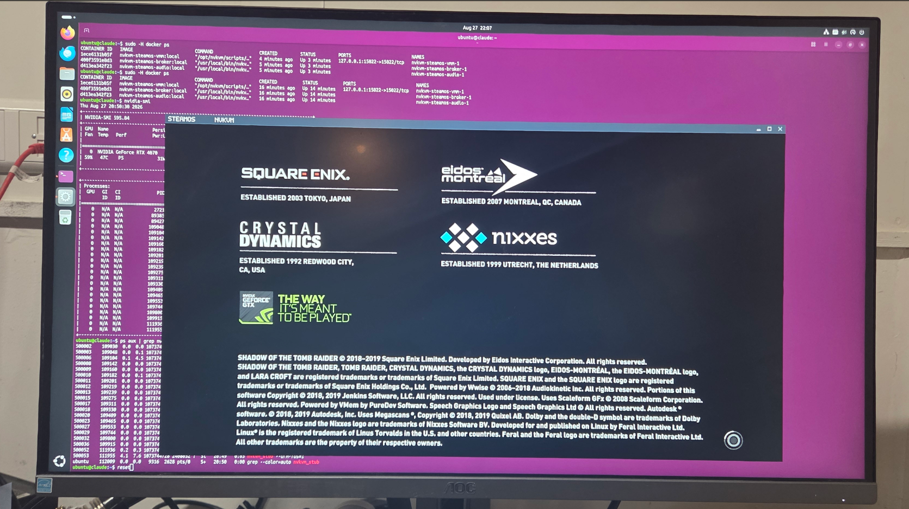
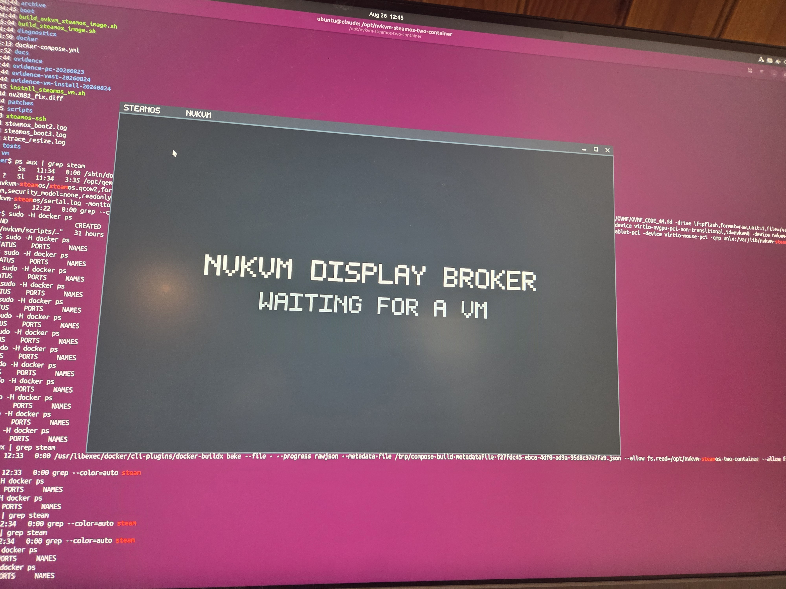

# nvkvm-pv on SteamOS

**Run SteamOS in a VM, play Steam games on your NVIDIA GPU — while the host keeps
using the same GPU.** No VFIO, no second graphics card, no rebooting into a
passthrough setup, and nothing unbound from your desktop.


*Shadow of the Tomb Raider, native Linux/Vulkan, in a SteamOS guest at 3760×2118 —
GPU at 80%, 168 W, full boost clocks, while the host desktop is still running on
the same RTX 4070.*

| | |
|---|---|
|  |  |
| Portal 2 in the guest | Launching from the SteamOS desktop |

## What this is

This repository is the **SteamOS integration layer** for
[nvkvm-pv](https://github.com/reindertpelsma/nvkvm-pv). nvkvm-pv is the GPU
paravirtualization implementation; this repo builds the SteamOS image, provisions
it, and ships the deployment that puts a guest desktop in a window on your host.

**It is not VFIO.** No real GPU device is bound to the VM and the host never loses
the card. The guest talks to your host's NVIDIA driver through nvkvm — closer to
how a CUDA container shares a GPU than to passthrough.

SteamOS is a demanding test target for nvkvm-pv: a full Plasma desktop, a real
compositor, games, audio, and a guest that expects to own its display. If it works
here, it works.

**Before you start:** NVIDIA only, Turing (GTX 16xx / RTX 20xx) or newer.
Anti-cheat games will not work. This is experimental software — see
[Known limits](#known-limits).

## Status

| area | state |
|---|---|
| SteamOS desktop | SteamOS 3.8.14 boots as an nvkvm guest on an RTX 4070; Plasma renders on the NVIDIA GPU. |
| Present path | GL zero-copy measured at 60 fps with `-vga none` — the visible desktop comes through nvkvm, not an emulated VGA fallback. A linear dma-buf path and a universal shm path cover hosts where the display is on an iGPU or AMD GPU while rendering happens on a discrete NVIDIA card, as on many laptops. |
| Games | Shadow of the Tomb Raider, Portal 2, Stardew Valley and Planetary Annihilation launch and play under the broker. Minecraft is playable under SDL on a non-SteamOS Linux guest. |
| Image creation | [`install_steamos_vm.sh`](install_steamos_vm.sh) creates a genuine dual-slot A/B SteamOS install using Valve's own installer, without host root. |
| Container split | The VMM/broker separation is policy-tested; restarting the broker does not disturb the running VM. |

Measured results, the display-backend matrix, open gaps and evidence links are in
[`docs/status.md`](docs/status.md).

## Quick start

Prerequisites: a graphical Linux session, Docker with the Compose plugin, working
`/dev/kvm`, a loaded NVIDIA driver, and the NVIDIA Container Toolkit.

```sh
docker compose build
docker compose up -d
docker compose logs -f broker vmm
./steamos-ssh
```

On first start this downloads the SteamOS recovery image, boots a disposable
installer VM, lets Valve's installer create a real dual-slot A/B qcow2, provisions
it with nvkvm's guest module and NVIDIA userspace matching your host driver, then
boots Plasma. It takes a while and needs no input.



Persistent state, security boundaries, Wayland/X11 selection, published images and
configuration knobs are documented in
[`docs/container-compose.md`](docs/container-compose.md).

## FAQ

**Is this a VFIO utility that binds the GPU to a VM?**
No. There is no VFIO and no real GPU device is bound to the VM. Your host GPU is
genuinely shared with the guest, similar to CUDA containers. The VM gets access to
your GPU for graphics and compute; the host keeps using it throughout.

**Will my GPU work?**
NVIDIA only, Turing (GTX 16xx / RTX 20xx) or newer. Six architectures are tested,
from GTX 1660 to H100 — see the tested-platforms table in nvkvm-pv. Pascal and
older do not work.

**How much of my GPU does the VM get?**
VRAM and CUDA cores are shared, as in CUDA containers. When the VMM runs in a
container it can only reach what that container was provisioned with.

**How do I go fullscreen, or make my in-game character follow the mouse?**
`CTRL+ALT+F` toggles fullscreen. `CTRL+ALT+G` toggles grab mode, which hands your
keyboard and mouse to the guest until you press it again. Most first- and
third-person games need grab mode, because it delivers real relative mouse motion
(dx/dy) instead of absolute coordinates over the guest window.

**Will my GPU driver work?**
Only the host driver matters. The guest automatically installs the CUDA userspace
matching whatever driver the host runs. Only NVIDIA's official kernel driver is
supported ([open-gpu-kernel-modules](https://github.com/nvidia/open-gpu-kernel-modules));
most distributions preinstall it for Turing and newer. Nouveau is not supported.
nvkvm-pv tracks 216 OGKM tags for ABI, so a wide range of driver versions works,
though not all are equally well tested — see the support matrix in nvkvm-pv.

**Will the VM break when my host driver updates?**
No. At boot the guest asks nvkvm for the host driver version, and on a mismatch it
installs the official NVIDIA runfile for that version before continuing. Your
guest follows your host automatically.

**Does it survive SteamOS updates?**
Yes. During an A/B update the boot script reprovisions the newly updated slot with
nvkvm, libcuda and the CUDA/Vulkan libraries.

**Is headless supported?**
nvkvm-pv supports headless rendering desktops you can connect to remotely, but the
scripts in this repository are not configured for it.

**I downloaded SteamOS from Valve's site — does Steam delete my games every launch?**
Not any more, but it is worth knowing why. Valve's official download button gives
you an **OOBE image** (`steamdeck-oobe-repair-*.img`), whose `/usr/bin/steam` runs

```
rm -rf --one-file-system "$HOME"/.steam "$HOME"/.local/share/Steam
```

**unconditionally on every launch** — login, library index and installed games.
Valve's own comment explains it: *"On OOBE images we want to always start with a
fresh steam per boot as we lack the proper steam overlay/repair code."* That is
fine for the handful of boots before a real Steam Deck's first update graduates
it to normal SteamOS; it is catastrophic on a machine anyone actually uses.

Provisioning detects this and disables that line, so **your data is safe**. But an
OOBE image genuinely lacks Steam's repair machinery, so a Steam install that does
break will not self-heal. To move to real SteamOS, run inside the guest:

```sh
sudo steamos-update      # several GB; reboots into the other A/B slot
```

After that the guest is `VARIANT_ID=steamdeck` with the normal launcher, and our
patch stops applying by itself.

**Will anti-cheat work?**
No, and this is a won't-fix. Anti-cheat generally breaks under VMs by design —
strict implementations deliberately require bare metal and full root access, often
via kernel modules. Games that depend on it cannot be meaningfully sandboxed; you
have to trust the vendor to have hardened the client against hostile servers and
players.

**Will DRM-protected games work?**
Most likely. DRM is far less strict than anti-cheat, and Steam authenticates your
account rather than the device.

**Where is my game data, and how do I get more disk space?**
In a qcow2 image containing two fixed-size read-only SteamOS partitions (the A/B
slots, which give atomic updates with fallback to the previous version if a boot
fails) and a home partition at the end holding your files and games, which can
grow. The Compose deployment sizes it to at least 64 GiB and at most 1024 GiB,
targeting 60% of the host's free space. If it is too small, resize the disk and
then the last partition.

**How do I copy and paste?**
Through vdagent (QEMU SPICE) when using the broker. Copy works while the window has
focus; paste requires explicit consent — press `CTRL+V` or `CTRL+SHIFT+V` while
focused, the same model Firefox and Safari use. Pasting from a right-click menu may
therefore not receive the host clipboard: press `CTRL+V` to send it, even if that
shortcut does nothing in the guest application itself.

**Why are there three containers — vmm, broker and audio?**
Security, and it is not SteamOS-specific. For native performance the VMM needs the
guest's frames on your display; streaming them headlessly would add latency and
complexity. But mounting your Wayland or X11 socket into the VMM would grant it
full access to your display and every input — close to a host compromise. So the
broker runs in its own container and gives the VMM only the display *contents*,
and input only while the window has focus or grab mode is on. Zero-copy rendering
still works. The audio container applies the same principle to sound.

The effect: most QEMU or nvkvm breakouts land in an unprivileged CUDA container
with most capabilities stripped and nowhere to attach a keylogger. A breakout
through KVM into the host kernel is a far higher bar.

## Known limits

- The smooth SteamOS cursor currently depends on `KWIN_FORCE_SW_CURSOR=1`. A real
  cursor plane in nvkvm is the durable fix.
- The installer produces an A/B image that *can* exercise SteamOS update behaviour,
  but an end-to-end OTA update-hook run is not documented here yet.
- **nvkvm-pv is experimental and is not a hardened guest/host security boundary.**
  Do not use it for untrusted tenants. The VMM is confined to a tight container
  with no access to your display socket, which limits the damage of a breakout —
  it does not eliminate it.

## Build an image outside Docker

For a SteamOS qcow2 on the host instead of the full Compose deployment:

```sh
./install_steamos_vm.sh --repair steamdeck-repair-*.img --out steamos.qcow2
```

This path needs `qemu-system-x86_64`, `qemu-img`, OVMF, common archive tools,
`/dev/kvm`, and a loaded NVIDIA driver for provisioning — but no `sudo`,
`losetup`, host mounts or chroot. Provisioning in the same run, the full option
set and verified output are in [`docs/vm-installer.md`](docs/vm-installer.md).

## Docs

| read | for |
|---|---|
| [`docs/container-compose.md`](docs/container-compose.md) | the supported runtime/deployment path |
| [`docs/vm-installer.md`](docs/vm-installer.md) | the non-Docker image builder, and why it replaced loop/chroot |
| [`docs/status.md`](docs/status.md) | measured results, display backend matrix, open gaps, evidence links |
| [`docs/manual-install.md`](docs/manual-install.md) | the root-requiring provisioning path by hand; useful for debugging |
| [`TUTORIAL.md`](TUTORIAL.md) | a full source-build walkthrough, kept as a low-level reference |
| [`boot/TESTING.md`](boot/TESTING.md) | chronological validation notes and regressions found on real rigs |
| [`NOTES.md`](NOTES.md) | historical investigation log |
| [`archive/`](archive/README.md) | superseded scripts kept for reference |

## Credit

The SteamOS provisioning approach builds on
[28allday/steamos-nvidia-installer](https://github.com/28allday/steamos-nvidia-installer),
which established the offline NVIDIA-on-SteamOS pattern: operate on an unmounted
rootfs, fetch exact `linux-neptune-*-headers` from Valve's mirror, build in a
throwaway chroot, and survive atomic updates.

This project substitutes nvkvm's guest module into that pattern while keeping the
NVIDIA userspace side intact.
